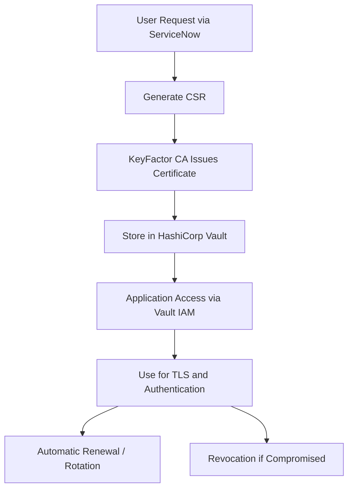

# Automated and Secure Digital Certificate Management

## 1. Vision and Goals of the Project
- **Vision Statement:**  
  To build an automated, secure, and scalable digital certificate management system tailored for highly regulated financial firms, ensuring compliance, reliability, and ease of use. This system will streamline the entire PKI lifecycle from certificate creation to renewal.

- **Key Goals:**  
  - Automated: Minimize need for manual input/direction to speed up delivery.  
  - Secure: Ensure private keys are securely generated, stored, and accessed only by those with authorization.
  - Intuitive: Users should be able to request and manage certificates via a user-friendly ServiceNow form.

### Project Priorities (P0–P3)

| Priority | Description | Status |
|----------|-------------|--------|
| **P0 (Must-Have: Core MVP)** | - Automate certificate requests and approvals through ServiceNOW. - Ensure certificates and private keys are securely generated and stored (via Keyfactor + HashiCorp Vault ). | Core requirements |
| **P1 (High Priority: Security & Access Control)** | - Provide controlled access to certificates through HashiCorp Vault with IAM-based validation (using Google Cloud IAM roles ). | Core requirements |
| **P2 (Future: Lifecycle Enhancements)** | - Support seamless certificate lifecycle management, including issuance, renewal, rotation, and revocation (e.g., Cloud Scheduler + Vault APIs). | Future work |
| **P3 (Future: Reliability & Compliance)** | - Minimize operational risks of expired or compromised certificates in production systems. - Implement monitoring, logging, and auditing (Google Cloud Monitoring, ServiceNOW logs, Vault audit logs). | Future work |
---

## 2. Users / Personas of the Project
- **Primary User Roles:**  
  - Application Teams: Will want to request and retrieve certificates and rely on automated renewal of certificates to avoid outages.  
  - Role B: key characteristics, needs, expectations  
  - Role C: key characteristics, needs, expectations  

---

## 3. Scope and Features of the Project
- **In-Scope Features:**  
  - Feature A  
  - Feature B  
  - Feature C  

- **Out-of-Scope Features:**  
  - Feature X  
  - Feature Y  

---

## 4. Solution Concept

### 4.1 Certificate Lifecycle Pipeline

### 4.2 Global Architectural Structure of the Project
- **High-Level Architecture:**  
  (Insert conceptual diagram or system architecture figure here)  
- **Walkthrough Explanation:**  
  _Describe the main components, their interactions, and overall workflow._  

### 4.3 Design Implications and Discussion
- Rationale for design decisions  
- How architecture supports scalability, maintainability, and user experience
- Security is the first priority: Private keys are never exposed outside of Vault and are accessed only by authenticated, authorized, entities.

---

## 5. Acceptance Criteria
- **Minimum Acceptance Criteria:**  
  - [ ] Users can submit cerficiate requests with ServiceNow
  - [ ] Certificates and private keys successfully issued by certificate authorities
  - [ ] Certiifcate and private keys are stored securely in Vault
  - [ ] Only authorized applications can access certificates from Vault
- **Stretch Goals:**  
  - [ ] Automated renewal/rotation of certificates to avoid downtime
  - [ ] Extended feature B  

---

## 6. Release Planning
- **Release Strategy:**  

- **Planned Iterations:**  
  - Iteration 1: (Features / User Stories)  
  - Iteration 2: (Features / User Stories)  
  - Iteration 3: (Features / User Stories)  

- **Higher-Level Details for the First Iteration:**  
  - User Story 1  
  - User Story 2  
  - User Story 3  

---

## Appendix 
- References  
