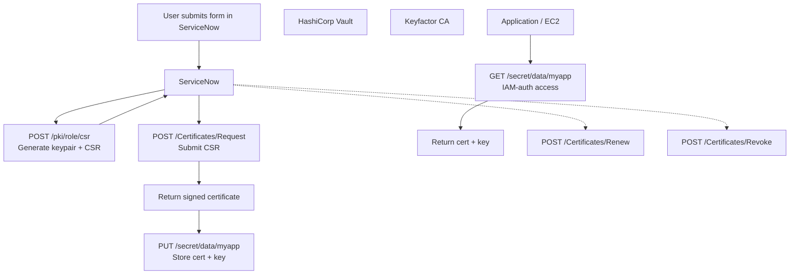

# Automated and Secure Digital Certificate Management

## 1. Vision and Goals of the Project
### 1.1 Vision Statement
  To build an automated, secure, and scalable digital certificate management system tailored for highly regulated financial firms, ensuring compliance, reliability, and ease of use. This system will streamline the entire PKI lifecycle from certificate creation to renewal.

### 1.2 Key Goals  
  - Automated: Minimize need for manual input/direction to speed up delivery.  
  - Secure: Ensure private keys are securely generated, stored, and accessed only by those with authorization.
  - Intuitive: Users should be able to request and manage certificates via a user-friendly ServiceNow form.

### 1.3 Project Priorities (P0–P3)

| Priority | Description | Status |
|----------|-------------|--------|
| **P0 (Must-Have: Core MVP)** | - Automate certificate requests and approvals through ServiceNOW. - Ensure certificates and private keys are securely generated and stored (via Keyfactor + HashiCorp Vault ). | Core requirements |
| **P1 (High Priority: Security & Access Control)** | - Provide controlled access to certificates through HashiCorp Vault with IAM-based validation (using Google Cloud IAM roles ). | Core requirements |
| **P2 (Future: Lifecycle Enhancements)** | - Support seamless certificate lifecycle management, including issuance, renewal, rotation, and revocation (e.g., Cloud Scheduler + Vault APIs). | Future work |
| **P3 (Future: Reliability & Compliance)** | - Minimize operational risks of expired or compromised certificates in production systems. - Implement monitoring, logging, and auditing (Google Cloud Monitoring, ServiceNOW logs, Vault audit logs). | Future work |
---

## 2. Users / Personas of the Project
### 2.1 Primary User Roles:**  
  - Application Teams: Will want to request and retrieve certificates and rely on automated renewal of certificates to avoid outages.  
  - Security Teams: Can manage and monitor certificate issuance, review and approve requests, and monitor activity logs. 

### 2.2 Team Roles (5 Members)  
- **Backend Engineer (Certificates & Vault Integration)** @[Siyuan Jing](https://github.com/ChingSsuyuan)  
  - Responsible for the end-to-end certificate lifecycle: CSR generation, certificate issuance, and secure storage in Vault.  
  - Act as the bridge between Vault and ServiceNow, ensuring seamless integration and data flow between both systems.  

- **Platform Engineer (Cloud & IAM Integration)**  
  - Configure IAM roles, enforce access policies, set up cloud infrastructure.  

- **Frontend / ServiceNow Engineer**  
  - Build ServiceNow request form, integrate approval workflow with backend APIs.  

- **DevOps Engineer (CI/CD & Automation)**  
  - Implement CI/CD pipeline, automated certificate renewal and rotation, deployment automation.  

- **Security Engineer (Audit & Compliance)**  
  - Ensure certificate policies follow org standards.  
  - Monitor issuance and access logs, set up alerting for anomalies.  

---

## 3. Scope and Features of the Project
### In-Scope Features  
- Automated certificate request submission via **ServiceNow form integration**  
- Certificate issuance and secure storage using **Keyfactor + HashiCorp Vault**  
- Application access to certificates and private keys from **Vault**, validated through **IAM Roles**  

### Out-of-Scope Features  
- **Manual certificate management** (outside of the automated workflow)  
-  

---

## 4. Solution Concept

### 4.1 Certificate Lifecycle Pipeline

[To find detailed flowchart](https://ec528-fall-2025.github.io/AutoSec-Certs/)
<!-- #### 4.1.1 Backend Responsibilities

- Generate key pair (public/private key)  
- Securely store the private key  
- Create a CSR (Certificate Signing Request)  
- Submit CSR to the Certificate Authority (CA) and receive the certificate  
- Store both the certificate and private key in HashiCorp Vault   -->
### 4.1 Global Architectural Structure of the Project
#### 4.1.1 Certificate Lifecycle

A typical certificate lifecycle consists of the following stages:

1. **Request** – Generate a key pair and submit a Certificate Signing Request (CSR) to a Certificate Authority (CA).  
2. **Issue** – The CA signs the CSR and returns the certificate.  
3. **Application Use** – The application uses the certificate for encryption (TLS/SSL) and authentication.  
4. **Renew** – The certificate must be replaced with a new one before it expires.  
5. **Revoke** – The certificate can be canceled if compromised or no longer needed.

#### 412.2 How This Applies to Our Project

Our project automates the above lifecycle using cloud-native tooling:

- **Request** – User submits a certificate request via **ServiceNow**.  
- **Issue** – Certificate and private key are generated using **Keyfactor** (or AWS PCA).  
- **Store** – The issued certificate and private key are securely stored in **HashiCorp Vault**.  
- **Access** – Applications retrieve the certificate and key from Vault, validated via **AWS IAM roles**.  
- **Rotate** – New certificates are automatically issued before expiration and updated in Vault.

### 4.3 Design Implications and Discussion
- Rationale for design decisions  
- How architecture supports scalability, maintainability, and user experience
- Security is the first priority: Private keys are never exposed outside of Vault and are accessed only by authenticated, authorized, entities.

---

## 5. Acceptance Criteria
- **Minimum Acceptance Criteria:**  
  - [ ] Users can submit cerficiate requests with ServiceNow
  - [ ] Certificates and private keys successfully issued by certificate authorities
  - [ ] Certiifcate and private keys are stored securely in Vault
  - [ ] Only authorized applications can access certificates from Vault
  - [ ] Activity logs are maintained so suspicious events can be spotted
- **Stretch Goals:**  
  - [ ] Automated renewal/rotation of certificates to avoid downtime

---

## 6. Release Planning
- **Release Strategy:**
## Sprint 1: Project Setup & Exploration (9/24 – 10/1)
Scrum Master: Ethan Liang
- Familiarized ourselves with the overall project goals.  
- Developed a clear and detailed project description.  
- Outlined the workflow pipeline for the system.  
- Began experimentation with the ServiceNow Developer Program environment.
- [Video](.assets/video2710124989.mp4)  
- [Slides](https://docs.google.com/presentation/d/1PIYamKVhi-m9k4DFpzvKhFeDj9LKj33SVk3x0rdOPUo/edit?usp=sharing)

## Sprint 2:Workflow & Integration Foundations (10/2 - 10/15)
Scrum Master: Logan Lechuga

Goals: Establish core workflows for certificate lifecycle management, focusing on request, approval, issuance, and storage.
-	Design and implement ServiceNow workflow for certificate requests and approvals.
-	Determine how we will scrape ServiceNow forms for user inputted information and sending that info to backend.
-	Prototype Vault integration for keypair generation, CSR submission, and certificate storage.
-	Document certificate renewal and rotation flow (including CSR regeneration and switchover period).
-	Add admin user persona to capture monitoring, auditing, and operational needs.
-	Update system architecture diagrams to reflect detailed flows, specifically the Hashicorp vault section of our project flow.
-	Begin testing workflow execution end-to-end.

---

## Appendix 
- References  
