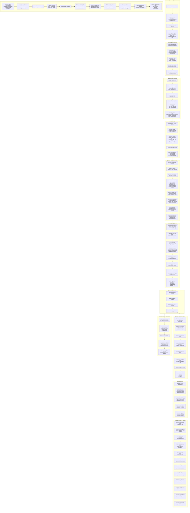

```mermaid
flowchart TD
  subgraph SN[ServiceNow Portal]
    A1[User submits request via Portal]
    A2[Fill form data:<br/>- Common Name CN<br/>- Subject Alternative Names SAN<br/>- Certificate validity period<br/>- Business unit info]
    A3[ServiceNow Workflow triggered]
    A4[ServiceNow calls Backend API:<br/>POST /api/cert-request<br/>Headers: Authorization Bearer token<br/>Payload: JSON with form data]
  end

  subgraph BE_REQ[Backend - Request Handler]
    B1[FastAPI receives request<br/>Endpoint: /api/cert-request]
    B2[Validate input data:<br/>- CN format validation<br/>- SAN domain verification<br/>- TTL range check]
    B3[Store request in DB:<br/>status = pending<br/>request_id generated]
    B4[Call Vault client function:<br/>vault.generate_certificate]
    B5[Pass parameters:<br/>common_name, alt_names,<br/>ttl, key_type, key_bits]
  end

  subgraph BE_VAULT[Backend - Vault Operations]
    C1[vault.py: VaultClient.init]
    C2[Authenticate to Vault:<br/>Method: AppRole<br/>POST /v1/auth/approle/login<br/>Body: role_id, secret_id]
    C3[Receive Vault token:<br/>X-Vault-Token for subsequent calls]
    C4[Prepare CSR request data:<br/>JSON payload with:<br/>- common_name<br/>- alt_names array<br/>- ttl seconds<br/>- key_type: rsa/ecdsa<br/>- key_bits: 2048/4096]
    C5[Call Vault PKI API:<br/>POST /v1/pki/intermediate/generate/internal<br/>Headers: X-Vault-Token<br/>Body: CSR parameters]
  end

  subgraph VAULT[HashiCorp Vault]
    D1[Vault PKI Engine receives request]
    D2[Generate key pair:<br/>- Private key RSA 2048<br/>- Public key derived]
    D3[Build CSR structure:<br/>- Subject: CN, O, OU, L, ST, C<br/>- Extensions: SAN, Key Usage<br/>- Signature algorithm: SHA256withRSA]
    D4[Encode CSR to PEM format]
    D5[Return CSR to Backend:<br/>JSON response:<br/>csr: PEM string<br/>csr_id: unique identifier]
  end

  subgraph BE_CA[Backend - CA Communication]
    E1[Backend receives CSR from Vault]
    E2[Select CA endpoint<br/>config.CA_TYPE: aws_pca]
    E3[Call AWS PCA via boto3:<br/>client.issue_certificate]
    E4[Parameters to AWS PCA:<br/>- CertificateAuthorityArn<br/>- Csr: PEM bytes<br/>- SigningAlgorithm: SHA256WITHRSA<br/>- Validity: Days value<br/>- TemplateArn: certificate template]
    E5[AWS PCA validates CSR:<br/>- Signature verification<br/>- Policy compliance check]
    E6[AWS PCA signs certificate:<br/>- Use CA private key<br/>- Generate X.509 certificate<br/>- Assign serial number]
    E7[Poll for certificate:<br/>client.get_certificate<br/>CertificateArn from issue response]
    E8[Receive certificate chain:<br/>- Certificate: PEM format<br/>- CertificateChain: Intermediate + Root]
  end

  subgraph BE_STORE[Backend - Store Certificate]
    F1[Backend parses certificate:<br/>- Extract serial number<br/>- Extract expiration date<br/>- Verify certificate validity]
    F2[Call Vault to store cert:<br/>POST /v1/secret/data/certs/app-name/cert-id<br/>Headers: X-Vault-Token]
    F3[Payload to Vault:<br/>JSON data object with:<br/>- certificate: PEM string<br/>- private_key: encrypted PEM<br/>- ca_chain: PEM chain<br/>- serial_number: hex string<br/>- expiration: ISO timestamp<br/>- metadata: request info]
    F4[Vault stores in KV Secret Engine:<br/>Path: secret/data/certs/...]
    F5[Vault creates versioned secret<br/>Returns version number]
    F6[Backend updates DB record:<br/>status = issued<br/>certificate_id, serial, expiry<br/>vault_path stored]
    F7[Return response to ServiceNow:<br/>JSON: request_id, certificate_id,<br/>serial_number, expiration_date,<br/>download_url]
  end

  subgraph SN_RESP[ServiceNow Response]
    G1[ServiceNow receives response]
    G2[Update ticket status: Fulfilled]
    G3[Send notification email to requester]
    G4[Store certificate metadata in CMDB]
  end

  subgraph APP_ACCESS[Application Access via Backend]
    H1[Application calls Backend API:<br/>GET /api/cert/cert-id/download]
    H2[Authentication methods:<br/>- API Key in header<br/>- Service Account token<br/>- mTLS client certificate]
    H3[Backend validates auth token]
    H4[Backend calls Vault:<br/>GET /v1/secret/data/certs/app-name/cert-id<br/>Headers: X-Vault-Token]
    H5[Vault validates token and policy]
    H6[Vault returns encrypted data:<br/>JSON with certificate and key]
    H7[Backend decrypts if needed]
    H8[Return to application:<br/>JSON or ZIP file with:<br/>- server.crt<br/>- server.key<br/>- ca-chain.crt]
  end

  subgraph APP_USE[Application Usage]
    I1[Application receives certificate files]
    I2[Write to filesystem:<br/>- /etc/ssl/certs/app.crt<br/>- /etc/ssl/private/app.key<br/>File permissions: 600]
    I3[Configure TLS/SSL:<br/>- Web server: Nginx/Apache<br/>- App framework config<br/>- Database connections]
    I4[Enable mTLS if required:<br/>- Client cert verification<br/>- Server cert verification]
    I5[Log certificate usage:<br/>- Certificate fingerprint<br/>- Activation timestamp<br/>- Application identifier]
  end

  subgraph RENEW[Certificate Renewal via Backend]
    J1[Backend scheduled job runs:<br/>Cron: daily at 2 AM]
    J2[Query DB for expiring certs:<br/>WHERE expiration < NOW + 30 days]
    J3[For each expiring certificate:<br/>Call renewal function]
    J4[Backend calls Vault API:<br/>POST /v1/pki/issue/role-name<br/>Same CN and SAN parameters]
    J5[Vault generates new keypair<br/>and creates CSR]
    J6[Backend submits to AWS PCA<br/>Same flow as initial request]
    J7[Store new certificate in Vault<br/>New version in same path]
    J8[Update DB with new expiration<br/>Keep old cert for 30 days]
    J9[Backend calls notification API:<br/>POST /api/notify/cert-renewed]
    J10[Application polls Backend:<br/>GET /api/cert/check-updates]
    J11[Application downloads new cert<br/>Performs hot reload or restart]
    J12[Backend logs renewal event:<br/>Audit log with timestamps]
  end

  subgraph REVOKE[Certificate Revocation via Backend]
    K1[Revocation trigger:<br/>- Security incident<br/>- Application decommission<br/>- User request via ServiceNow]
    K2[ServiceNow or Admin calls:<br/>POST /api/cert/cert-id/revoke<br/>Body: reason code]
    K3[Backend validates request<br/>Check permissions]
    K4[Backend calls Vault:<br/>POST /v1/pki/revoke<br/>Body: serial_number]
    K5[Vault processes revocation]
    K6[Backend calls AWS PCA:<br/>client.revoke_certificate<br/>Parameters: CertificateArn,<br/>RevocationReason]
    K7[AWS PCA updates CRL:<br/>Certificate Revocation List<br/>OCSP responder updated]
    K8[Backend marks cert as revoked in DB<br/>status = revoked<br/>revocation_timestamp]
    K9[Backend notifies application:<br/>POST to app webhook:<br/>cert_id, revocation_time]
    K10[Application stops using certificate<br/>Requests new certificate]
    K11[Backend logs revocation event:<br/>Audit log: reason, timestamp,<br/>requester identity]
  end

  subgraph MONITOR[Backend Monitoring & Dashboard]
    L1[React Dashboard loads:<br/>GET /api/dashboard/stats]
    L2[Backend queries DB:<br/>- Total certificates<br/>- Expiring soon count<br/>- Recent requests<br/>- Failed requests]
    L3[Return metrics as JSON]
    L4[Dashboard displays:<br/>- Certificate inventory table<br/>- Expiration timeline chart<br/>- Recent activity log<br/>- Health status indicators]
    L5[Auto-refresh every 30 seconds<br/>WebSocket for real-time updates]
  end

  A1 --> A2
  A2 --> A3
  A3 --> A4
  A4 --> B1
  B1 --> B2
  B2 --> B3
  B3 --> B4
  B4 --> B5
  B5 --> C1
  C1 --> C2
  C2 --> C3
  C3 --> C4
  C4 --> C5
  C5 --> D1
  D1 --> D2
  D2 --> D3
  D3 --> D4
  D4 --> D5
  D5 --> E1
  E1 --> E2
  E2 --> E3
  E3 --> E4
  E4 --> E5
  E5 --> E6
  E6 --> E7
  E7 --> E8
  E8 --> F1
  F1 --> F2
  F2 --> F3
  F3 --> F4
  F4 --> F5
  F5 --> F6
  F6 --> F7
  F7 --> G1
  G1 --> G2
  G2 --> G3
  G3 --> G4
  G4 --> H1
  H1 --> H2
  H2 --> H3
  H3 --> H4
  H4 --> H5
  H5 --> H6
  H6 --> H7
  H7 --> H8
  H8 --> I1
  I1 --> I2
  I2 --> I3
  I3 --> I4
  I4 --> I5
  I5 --> J1
  J1 --> J2
  J2 --> J3
  J3 --> J4
  J4 --> J5
  J5 --> J6
  J6 --> J7
  J7 --> J8
  J8 --> J9
  J9 --> J10
  J10 --> J11
  J11 --> J12
  K1 --> K2
  K2 --> K3
  K3 --> K4
  K4 --> K5
  K5 --> K6
  K6 --> K7
  K7 --> K8
  K8 --> K9
  K9 --> K10
  K10 --> K11
  G4 --> L1
  L1 --> L2
  L2 --> L3
  L3 --> L4
  L4 --> L5
```